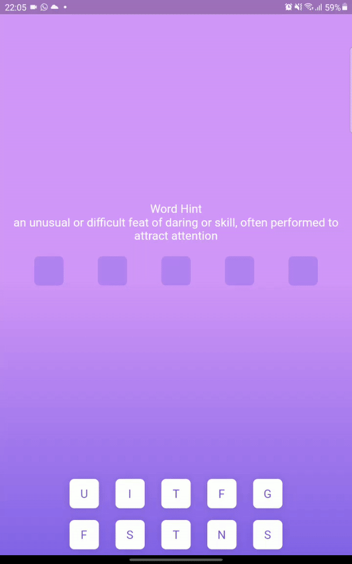

# Word Jumble

This is a simple word game that came from a Java Project I had in school. I thought the idea was cool so I decided to remake it Flutter. It is a simple game where you guess what the word is by using the hint that is provided. Only two screens have been done so far but I assure more is on the way. Just wanted to get a proof of concept out quickly.

## Usage

